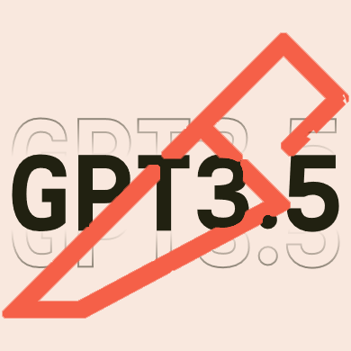
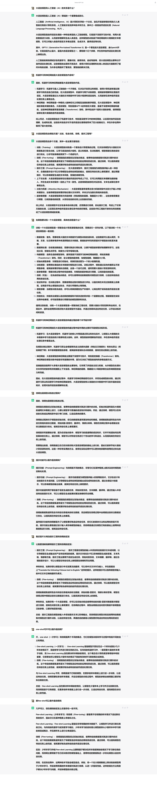

#  ChatGPT Screen Shooter

*预处理 ChatGPT 网页版的网页，配合浏览器自带截图功能实现截长图*

*仅适用于GPT-3.5页面*

*遇到问题，请提issue或反馈；*

*欢迎star或fork以跟进后续功能更新~*

# 安装-使用视频教程

[→【GPT滚动截图辅助插件】 ](https://www.bilibili.com/video/BV17L411z74w/?share_source=copy_web&vd_source=129e224f53094032a11cf21e89c97c2f)

# 效果预览

&nbsp;&nbsp;

## 下载

- 直接下载：点击上方“Code”按钮，选择最后一项“Download ZIP”
- 项目克隆：`git clone https://github.com/quarkape/gpt-screen-shooter`

&nbsp;

## 安装

1. 将完整的项目下载下来
2. 在地址栏输入`chrome://extensions/`（Edge浏览器是`edge://extensions/`）回车，进入扩展程序管理页面
3. 打开开发者模式，并在页面找到加载已解压的扩展程序并点击，选择解压后的本项目

&nbsp;

## 使用

### 1. 截图

- 在ChatGPT页面，进入一个chat会话

- 打开插件：点击“处理网页”按钮

- 打开浏览器的开发者工具页面（F12，或ctrl+shift+I，或点击浏览器右上角菜单自己找）

- 在开发者工具页面任意地方点一下，随后按下键盘组合键：ctrl+shift+p。在开发者工具页面会弹出运行（Run）窗口

- 在窗口中输入Capture full size screen（Edge的话输入中文：捕获全尺寸屏幕截图

- 点击上一步搜索出来的功能，浏览器开始滚动下载全图

- 如果要恢复页面，直接刷新页面即可

  

### 2. 复制到剪贴板

- 在ChatGPT页面，进入一个chat会话

- 打开插件：点击“复制文本”按钮即可完成

- 完成后插件页面会提示复制成功

  

### 3. 导出为.txt文件

- 在ChatGPT页面，进入一个chat会话
- 打开插件：点击“导出文本”按钮即可完成
- 完成后浏览器将开始导出为txt文件

&nbsp;

## 进阶使用

如果你了解基础的代码，你可以自行修改项目。

1. 修改导出图片内容所占宽度。在插件文件`content.js`中，你可以通过修改

&nbsp;

##  更新日志

- **v2.0.1 | 2023.7.28**
  1. 删除顶部模型名称
  2. 顶部留空更多，便于手机端查看，防止手机端刘海遮住内容
- **v2.0.0 | 2023.7.28**
  1. 支持复制文本
  2. 支持导出为.txt文件
  3. 修复官网更新导致的代码失效问题
  4. 增加导出图片的内容宽度、字号和字色，更易于观看
- **v1.0.0 | 2023.5.26**
  1. 支持导出截图（配合浏览器自带功能）
